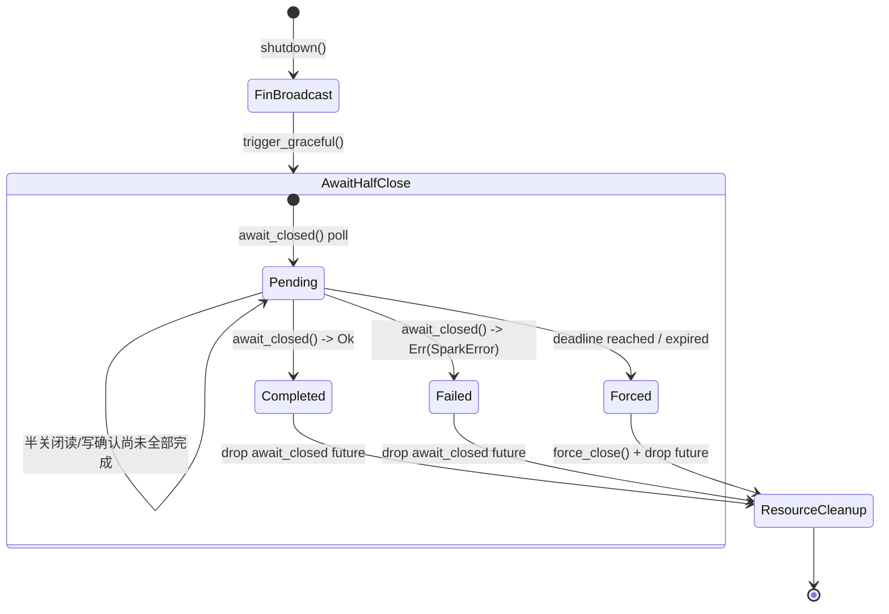

# 优雅关闭契约（T19）

## 背景（Why）
- T19 目标要求“所有长寿对象可通知关闭并等待完成”，以确保停机无未刷写/未确认的数据；
- 统一的协调器可为 Channel、Router、Transport 乃至自定义组件提供一致的关闭语义，避免宿主在多处复制样板代码；
- 在审计与演练场景中，需要记录“计划关闭”“强制终止”“返回错误”等信息，本契约配合日志、运维事件保证全链路可追溯。

## 行为流程（How）
1. 宿主通过 [`GracefulShutdownCoordinator`](spark_hosting::shutdown::GracefulShutdownCoordinator)
   注册需要管理的目标，可使用 `register_channel` 或 `register_target` + 回调；
2. 调用 `shutdown(reason, deadline)`：
   - 广播 `OpsEvent::ShutdownTriggered { deadline }`，通知观测系统开始停机；
   - 输出 INFO 日志，附带原因码、目标数量、计划截止时间，必要时可调用 `add_audit_trace` 附加 Trace；
   - 对所有目标执行 `trigger_graceful` 回调（Channel 将调用 `close_graceful`）；
   - 逐个等待 `await_closed` 完成，结合 `TimeDriver` 提供的计时器执行超时控制；
   - 若 Future 返回 `Err(SparkError)`，记录 ERROR 日志并在报告中标记 `Failed`；
   - 若等待超时，调用 `force_close` 执行硬关闭，同时输出 WARN 日志并在报告中标记 `ForcedTimeout`；
   - 汇总 [`GracefulShutdownReport`] 返回给调用方，内含每个目标的耗时与状态统计。

### 状态机时序

- **关键节点说明**：
  - `Pending` 阶段允许业务在 FIN 后继续处理读/写半关闭确认；`channel_half_close_requires_dual_ack_steps` 用例验证只有在两个确认到齐后才会离开该状态；
  - `Completed`/`Failed` 分支对 `await_closed` 的成功或异常作出区分，`channel_closed_future_error_reports_failure` 覆盖错误路径并确保资源会在 `ResourceCleanup` 中释放；
  - `Forced` 分支覆盖超时与截止时间已过期的强制终止，`pending_channel_times_out_and_forces_close` 与 `expired_deadline_triggers_immediate_force_close` 均断言 `force_close()` 调用以及 Future 被丢弃释放资源。

## 契约说明（What）
- **输入**：
  - `CloseReason` 使用稳定的 `namespace.code` 命名，与审计平台共享；
  - `Deadline` 可选，缺省视为无限期等待；协调器会基于当前 `TimeDriver::now()` 与 `sleep()` 计算剩余时间；
- **前置条件**：`CoreServices` 的 `runtime`、`logger`、`ops_bus` 必须有效；注册的回调需满足 `Send + Sync + 'static`；
- **后置条件**：
  - 所有目标至少收到一次优雅关闭通知；
  - 超时路径必定触发硬关闭并输出 WARN 日志；
  - [`GracefulShutdownReport::forced_count`]、[`GracefulShutdownReport::failure_count`] 提供快速风险评估指标；
  - 报告顺序与注册顺序一致，便于和日志/追踪做交叉对齐。

## 观测与审计
- 日志：
  - `INFO graceful shutdown initiated`：记录原因、目标数量、计划截止时间；
  - `ERROR graceful shutdown failed`：携带目标标签与错误码，附带 `SparkError` 链路；
  - `WARN graceful shutdown timed out and forced`：标记被强制终止的目标及耗时。
- 运维事件：统一广播 `OpsEvent::ShutdownTriggered`，字段 `deadline` 使用毫秒级 `Duration` 表达剩余时间；
- 报告：调用方可将 `GracefulShutdownReport` 序列化写入审计日志或指标系统，实现“关机一次对一次”的对账流程。

## 协调器与目标 API 摘要
- [`GracefulShutdownCoordinator::register_channel`](spark_hosting::shutdown::GracefulShutdownCoordinator::register_channel)：
  针对 `Arc<dyn Channel>` 的快捷入口，自动绑定 `close_graceful`/`closed`/`close`；
- [`GracefulShutdownCoordinator::register_target`](spark_hosting::shutdown::GracefulShutdownCoordinator::register_target)
  + [`GracefulShutdownTarget::for_callbacks`]：自定义对象注册路径，适配 Router、Service 等组件；
- [`GracefulShutdownCoordinator::add_audit_trace`](spark_hosting::shutdown::GracefulShutdownCoordinator::add_audit_trace)：
  将 TraceContext 注入日志，便于停机操作与业务调用链对齐；
- [`GracefulShutdownTarget::for_channel`]：封装 Channel 语义，保证传输层始终遵循统一关闭契约。

## CI 覆盖
- 集成测试位于 `crates/spark-core/tests/contracts/shutdown.rs`，覆盖：
  - 优雅关闭全部成功（无超时/无硬关闭）；
  - 截止时间到期触发硬关闭并记录 WARN 日志；
  - `await_closed` 返回 `SparkError` 时生成 `Failed` 记录。
- 套件依赖 `make ci-*` 序列执行，确保在 `cargo fmt/clippy/build/doc/bench` 及自定义检查中稳定通过。
- TCK：`crates/spark-contract-tests/src/graceful_shutdown.rs` 提供 FIN、半关闭读写、超时强制、错误回收等边界用例，覆盖所有状态转移。

> 若未来扩展到并发等待或分级关闭策略，请同步更新本文档与相应教案级注释，确保契约可被审计与回归验证。
