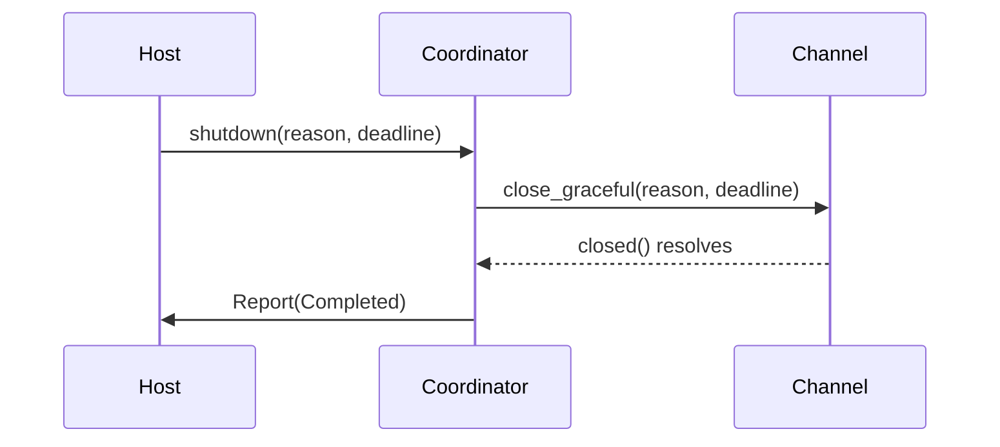
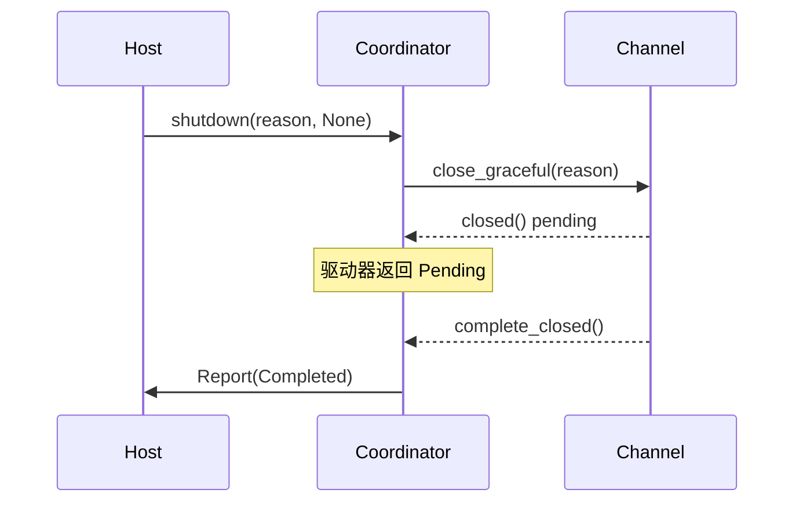
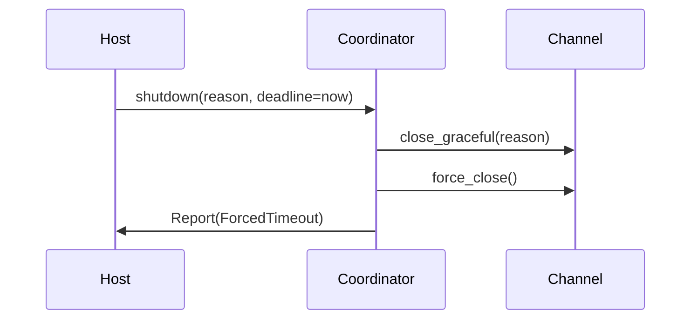
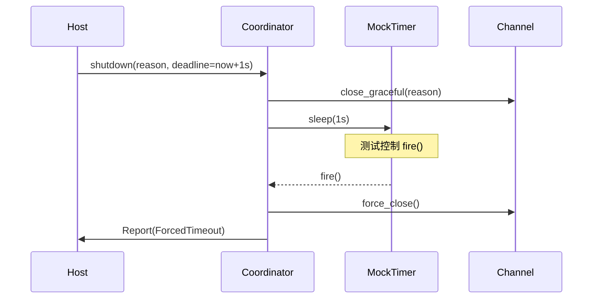
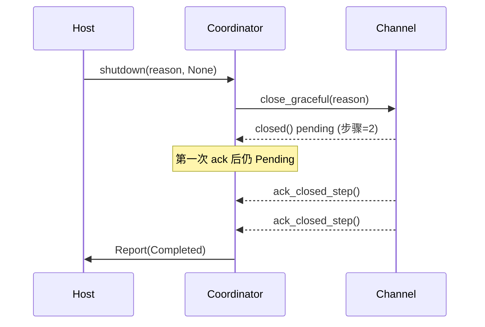
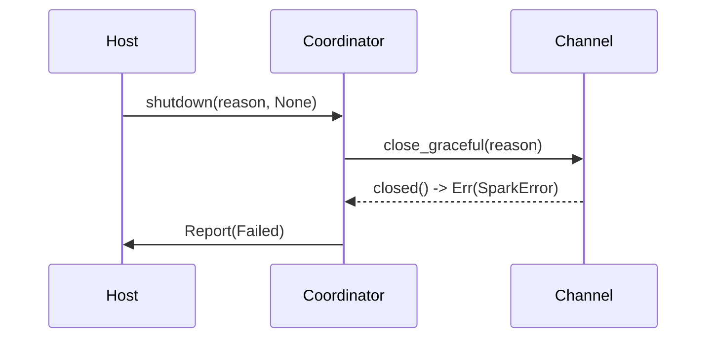

# 优雅关闭 TCK（MockTimer 确定性）

本文档概述 `spark-contract-tests` 中“优雅关闭”主题的确定性测试设计。所有用例均依赖 `MockTimer` 与 `ShutdownDriver`
组合，以确定性方式重现 FIN、半关闭、超时与错误路径。

## MockTimer + ShutdownDriver 设计
- **意图**：在无需真实线程调度的前提下，控制 `GracefulShutdownCoordinator` 的计时器与 Future 轮询顺序，避免竞态。
- **核心逻辑**：
  1. `ShutdownDriver` 保存 `shutdown()` 返回的 Future，允许测试在 `Poll::Pending` 状态插入断言；
  2. `MockTimer` 拦截 `sleep(duration)` 调用，返回可手动 `fire()` 的句柄，并记录触发顺序；
  3. 当测试触发 `fire()` 时，计时器推进单调时间并唤醒对应 Future。
- **契约检查**：所有断言均围绕 FIN 调用次数、`close()` 触发、`closed()` 完成状态、运维事件与日志等级展开。

## 用例一：FIN 仅触发一次

- **关键断言**：FIN 调用一次、`close()` 从未触发、运维事件与 INFO 日志各 1 条，报告状态为 `Completed`。

## 用例二：半关闭等待远端确认

- **关键断言**：等待阶段 `close()` 未调用，`complete_closed()` 后报告转为 `Completed`，`closed()` 完成计数为 1。

## 用例三：截止时间已过期立即强制

- **关键断言**：`close()` 立即触发一次、`MockTimer` 未记录休眠、WARN 日志出现“forced”字段。

## 用例四：等待超时后强制关闭

- **关键断言**：`MockTimer` 记录 1 秒休眠、`close()` 调用一次、WARN 日志包含 forced 关键字、`closed()` 未成功完成。

## 用例五：双向半关闭分步确认

- **关键断言**：两次 `ack_closed_step()` 后才返回，期间 `close()` 未触发，`closed()` 完成计数恰为 1。

## 用例六：`closed()` 报错路径

- **关键断言**：报告状态为 `Failed` 且错误码/信息匹配，`close()` 未调用，`closed()` 错误计数增加 1。

