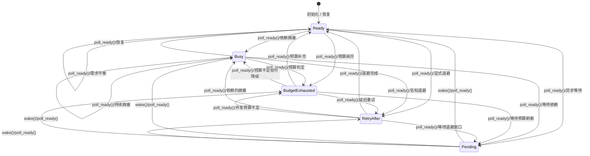

# ReadyState 状态机形式化

本节将 ReadyState 的五种状态（`Ready`、`Busy`、`BudgetExhausted`、`RetryAfter`、`Pending`）抽象为显式状态机，帮助在设计、测试与运维层面统一对齐状态语义与唤醒契约。

## 状态转换

下图使用 Mermaid 描述 ReadyState 的核心转换与事件来源。图中的 `poll_ready()` 表示框架驱动就绪检查，`wake()` 表示下游通过 Waker 唤醒。

> **判定要点**：
>
> - 所有非 `Pending` 状态均通过 `poll_ready()` 的返回值暴露；
> - 进入 `Pending` 后必须记录唤醒来源（下节）；
> - 任何从 `Pending` 离开的转换都必须伴随一次可观测的唤醒事件，避免“静默就绪”。

## 唤醒源定义

为确保排障与调度行为稳定，每一次从 `Pending` 唤醒都必须附带明确的来源标签。

| 唤醒源 | 说明 | 常见触发条件 |
| ------ | ---- | ------------ |
| `IoReady` | I/O 准备就绪信号 | 套接字、管道或存储驱动告知可读写 |
| `Timer` | 定时器到期 | 超时控制、退避窗口结束 |
| `ConfigReload` | 配置热更新 | 配置中心推送、动态限流策略变更 |

**约束：**

1. 每次 `poll_ready()` 返回 `Pending` 时，都必须提前登记允许唤醒的来源集合；
2. 唤醒事件必须在框架指标中曝光（`ready.state="pending"` → `wake.source=...`），以支撑观测；
3. 若同一次等待允许多个来源唤醒，应全部列入集合，便于后续定位（如 I/O + 定时器）。

## 性质校验与测试映射

> **目的**：确保“无灰区”——任何 Pending 都必须伴随可追踪的唤醒事件，且所有转换均为显式允许的边。

- **性质一（无不可达状态）**：利用 `spark-core/tests/state_machine_properties.rs` 中的 proptest 影子模型，
  生成任意合法事件序列并断言每一步转换都能被 ReadyState 接受，不会进入文档未定义的节点。
- **性质二（Pending 必有唤醒）**：同一影子模型记录每个 Pending 区间的唤醒集合，验证任何 Pending 在返回前都观察到了合法唤醒源。
- **性质三（唤醒有序可见）**：当启用 `--features loom-model` 时，Loom 场景会模拟 Pending 注册与唤醒的并发交错，
  检查唤醒标记在内存可见性层面不会丢失或超前，确保调度线程在恢复前一定看到至少一个唤醒标记。

通过上述定义与测试矩阵，ReadyState 的状态机、唤醒语义与实现测试之间形成一致闭环。
